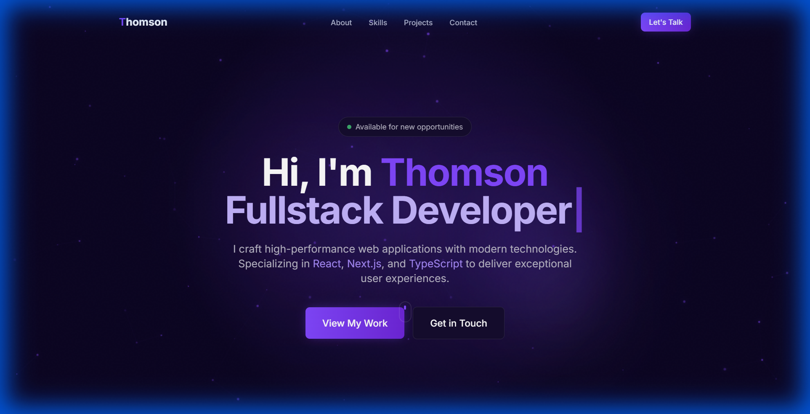

# Thomson | Full Stack Developer Portfolio

A premium, high-performance personal portfolio website built with **Next.js 14**, **TypeScript**, and **Framer Motion**.  
Designed to showcase advanced UI/UX capabilities through modern animations, interactive elements, and a polished dark-themed aesthetic.



## 🚀 Tech Stack

- **Framework**: [Next.js 14](https://nextjs.org/) (App Router)
- **Language**: [TypeScript](https://www.typescriptlang.org/)
- **Styling**: [Tailwind CSS](https://tailwindcss.com/)
- **Animations**: [Framer Motion](https://www.framer.com/motion/)
- **Icons**: [React Icons](https://react-icons.github.io/react-icons/)

---

## ✨ Features Implemented

This project includes 6 major enhancement categories providing a premium user experience:

### 1. 🎨 Animated Backgrounds
Dynamic, layered background effects that create depth without impacting performance.
- **Floating Particles**: interactive canvas-based particle system.
- **Gradient Orbs**: Slowly moving ambient light orbs.
- **Grid Pattern**: Subtle geometric overlay for structure.
- **Noise Texture**: Film-grain effect for texture consistency.

### 2. 🧭 Smart Navigation
A responsive, sticky navigation bar with advanced behaviors.
- **Glassmorphism**: Backdrop blur effect (`backdrop-blur-lg`).
- **Scroll Detection**: Changes appearance on scroll (transparent → glassy).
- **Active State**: Automatically highlights the current section while reading.
- **Scroll Progress**: A slim progress bar at the top indicating reading position.
- **Mobile Menu**: Smooth collapsible menu for smaller screens.

### 3. ⚡ Micro-Interactions
Delightful details that respond to user actions.
- **Typewriter Effect**: Dynamic text cycling for headlines (e.g., "UI/UX Developer", "Frontend Engineer").
- **Animated Counters**: Numbers that count up when scrolled into view (Experience years, Projects count).
- **Staggered Fade-ins**: Elements animate in sequence as you scroll down.

### 4. 🖼️ Visual Enhancements
High-quality visual components.
- **Animated Avatar**: Profile picture with a rotating gradient ring.
- **Browser Mockups**: Project screenshots wrapped in a clean browser frame.

### 5. 🖱️ Interactive Elements
Engaging components that react to mouse movement.
- **Magnetic Buttons**: Buttons that "stick" to and follow the cursor slightly.
- **3D Tilt Cards**: Project cards that tilt based on mouse position for a 3D effect.

### 6. 💼 Professional Sections
A complete structure for a professional portfolio.
- **Hero**: Impactful introduction with CTAs.
- **About**: Personal summary and stats.
- **Skills**: Grid layout of technical expertise.
- **Experience**: Vertical timeline of career history.
- **Projects**: Showcase of work with tilt cards and mockups.
- **Testimonials**: Client/Peer feedback section.
- **Contact**: Simple contact area with social links.

---

## 📂 Project Structure

```bash
src/
├── app/                 # Next.js App Router pages
├── components/
│   ├── sections/        # Main page sections (Hero, About, etc.)
│   │   ├── Experience.tsx
│   │   ├── Testimonials.tsx
│   │   └── ...
│   ├── ui/             # Reusable UI components
│   │   ├── TiltCard.tsx
│   │   ├── MagneticButton.tsx
│   │   ├── FloatingParticles.tsx
│   │   ├── Typewriter.tsx
│   │   └── ...
│   └── Navbar.tsx      # Main navigation
└── lib/                # Utilities and data
```

---

## 🛠️ Getting Started

1. **Clone the repository**
   ```bash
   git clone https://github.com/ThomsonSimbolon/portofolio-v3-soft-purple.git
   cd portofolio-v3-soft-purple
   ```

2. **Install dependencies**
   ```bash
   npm install
   ```

3. **Run development server**
   ```bash
   npm run dev
   ```

4. **Open in browser**
   Open [http://localhost:3000](http://localhost:3000) to see the result.

---

## 📄 License

[MIT](LICENSE) © 2024 Thomson
